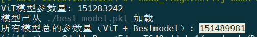

# JITTOR-Track1

​		比赛数据集由以下四个子数据集构成（Tsinghua-Dog数据集，Caltech-101数据集，Food-101数据集，动物分类自建数据集），共374个类别。对于每个类别，选手可以从训练集中挑出任意4张图片训练自己的模型，当训练结束后，对测试集的每张图片进行分类，输出每张图片的Top5分类。


## 1 环境配置

Jittor框架对环境要求如下:

- 操作系统: Ubuntu >= 16.04 或 Windows Subsystem of Linux（WSL）
- Python：版本 >= 3.7
- C++编译器 （需要下列至少一个）
- g++ （>=5.4.0）
- clang （>=8.0）
- GPU 编译器（可选）：nvcc >=10.0
- GPU 加速库（可选）：cudnn-dev (cudnn开发版, 推荐使用tar安装方法，[参考链接](https://docs.nvidia.com/deeplearning/cudnn/latest/installation/overview.html#installlinux-tar))

**Docker安装**

```cmd
# linux CPU only
docker run -it --network host jittor/jittor
# linux CPU and CUDA
docker run -it --network host --gpus all jittor/jittor-cuda
# mac/windows
docker run -it -p 8888:8888 jittor/jittor
```

**Pip 安装**

```cmd
sudo apt install python3.7-dev libomp-dev
python3.7 -m pip install jittor
# or install from github(latest version)
# python3.7 -m pip install git+https://github.com/Jittor/jittor.git
python3.7 -m jittor.test.test_example
```


## 2 方法详细思路

### 2.1 理论公式思路细节介绍

​		CLIP作为在大规模数据集上通用的模型，其性能表现需考虑到下游数据分布的特异性。已有研究表明，对于特定数据集，未经处理的特征输出可能包含部分信息冗余和噪声，这些冗余和噪声来自于与下游任务不相关的通道。为此，我们在图像特征提取后增加了可训练的特征蒸馏模块，使得蒸馏后的特征更适合下游任务。此外，对于零样本或少样本分类，仅依靠测试图像特征与文本特征的相似度匹配存在挑战。因此，类似于Tip-Adapter的方法，我们使用先验知识进行分类，通过在缓存空间中保存训练集的特征信息，利用测试图像、文本描述和训练图像之间的三边嵌入关系。在基本的测试图像-文本相似度之外，额外结合测试图像与训练图像的特征相似度进行校正，并利用训练图像-文本相似度提供补充信息。

#### 2.1.1  神经崩溃理论

​		神经崩溃描述了一类分类网络在最终状态时的特性，此时深度分类器通常表现出神经崩溃（NC）现象。神经崩溃本质上代表了一种最佳分类状态，其中最终隐藏层的类内变异性趋近于零，类均值则形成单纯形等角紧框架，表明分类器达到了最大离散状态。在预训练的CLIP模型中，图像特征由图像编码器输出，分类器则不是通过显式的神经网络训练，而是由图像-文本相似度直接决定。我们在下游数据上设计了一种接近神经崩溃状态的方法，具体而言，我们进一步诱导图像特征，使类内变异性更小，类间差异性更大。同时，我们设计了一种可训练的分类器，使其能够最大化利用并匹配这些特征表示，尽可能达到最大离散状态。

#### 2.1.2 特征通道蒸馏  

**（1）**从度量学习中最小化类间相似度出发，寻找一组最利于区分的特征表示通道。利用二进制向量$\mathbf{B}\in\{0,1\}^{D}$对CLIP提取的图像特征$\mathbf{x}\in\mathbb{R}^{D}$进行特征选择。优化任务如下:  
$$
\begin{aligned}&\min_{\mathbf{B}}\quad S=\sum_{i=1}^{C}P^{i}\sum_{\substack{j=1\\j\neq i}}^{C}P^{j}\frac{1}{M^{i}}\frac{1}{M^{j}}\sum_{m=1}^{M^{i}}\sum_{n=1}^{M^{j}}\delta(\mathbf{x}^{i,m},\mathbf{x}^{j,n}),\\&s.t.\quad\mathbf{BB}^{\top}=Q,\end{aligned}
$$


​		此外种类c的图像与文本‘***a photo of a [CLASS c]***’特征相似，可以使用该文本特征代替整个类别的特征中心，因此在减少计算的情况下还可使用文本特征进行特征选择。平衡上述两种方法，进一步优化:
$$
\begin{aligned}&\min_{\mathbf{B}}\quad S=\alpha\cdot\frac{1}{C^{2}}\sum_{i=1}^{C}\sum_{j=1\atop j\neq i}^{C}\delta(\mathbf{x}^{i}\odot\mathbf{B},\mathbf{x}^{j}\odot\mathbf{B})+  \left( 1-\alpha \right)\cdot\sum_{i=1}^{C}P^{i}\sum_{\substack{j=1\\j\neq i}}^{C}P^{j}\frac{1}{M^{i}}\frac{1}{M^{j}}\sum_{m=1}^{M^{i}}\sum_{n=1}^{M^{j}}\delta(\mathbf{x}^{i,m},\mathbf{x}^{j,n}),\\&s.t.\quad\mathbf{BB}^{\top}=Q,\end{aligned}
$$


​		上述方法的相似度函数可使用任何一个衡量特征相似程度的函数进行设计，本文中利用最简单的余弦相似度衡量，即  $\delta(\mathbf{x}^{i,m},\mathbf{x}^{j,n})=x_k^{i,m}\cdot x_k^{j,n}$  

**（2）**从度量学习中最小化类内变异出发，寻找另一组利于缩小类内差异的特征表示通道。具体来说，我们希望在一个固定的类别中，方差较小的通道激活，方差较大的通道关闭。对于类别i，其类内方差计算为 :
$$
V_k=\frac{1}{n}\sum_{m=1}^n(x_k^{i,m}-\bar{x_k^i})^2
$$
我们选择方差最小的前Q个通道，有效地过滤掉 CLIP 对下游数据集的先验知识中多余且信息量较少的通道。   
**（3）**最后，我们将相似性和方差标准与平衡因子混合作为最终衡量标准。对于第 k 个特征通道，我们将其加权为:  
$$
J_k=\lambda S_k-(1-\lambda)V_k
$$


#### 2.1.3 分类嵌入关系  

**（1）**基本的分类逻辑利用测试图像的特征$\mathbf{f}\in\mathbb{R}^{D}$与文本特征$\mathbf{W}\in\mathbb{R}^{C\times D}$进行相似度匹配: 
$$
\mathbf{R}_{fW}=\mathbf{fW}^{\top} \in\mathbb{R}^{1\times C}
$$
​		此外，利用训练集的图像特征$\mathbf{F}^{\prime}\in\mathbb{R}^{CK\times Q}$可以为测试数据的分类提供方向，利用经过蒸馏的特征计算归类相似度权重:
$$
\mathbf{R}_{f'F'}=\exp\left(-\beta(1-\mathbf{f'F'}^{\top})\right) \in\mathbb{R}^{1\times CK}
$$
​		并计算训练集蒸馏特征的归类置信度，利用训练集的分类结果与对应的独热向量$\text{L}$计算相似度:
$$
\mathbf{R}_{F^{\prime}W^{\prime}}=\exp\left(\gamma D_{KL}(\mathbf{F}^{\prime}\mathbf{W}^{\prime |}|\mathbf{L})\right) \in\mathbb{R}^{1\times CK}
$$
**（2）**引入可训练的残差网络进行进一步的适应特征，以达到类神经崩塌。具体来说，类别残差Res是由一组按类别的可学习嵌入实现的。每个嵌入对应一个下游类别，旨在在**few-shot**训练过程中针对不同类别个性化的优化蒸馏的Q特征通道。为了保留嵌入空间中的视觉语言对应性，同时应用于文本特征和训练集特征，此时的逻辑改变为  
$$
\mathbf{R}_{fW}=\mathbf{f}\Big(\mathbf{W}+\mathrm{Pad}(\mathbf{Res})\Big)^\top\\\mathbf{R}_{f'F'}=\exp\Big(-\beta\big(1-\mathbf{f}'\big(\mathbf{F}'+\mathrm{Expand}(\mathbf{Res})\big)^\top\big)\Big)
$$
**（3）**最终的输出由上述加权组成:  
$$
\mathrm{logits}=\mathbf{R}_{fW}+\alpha\mathbf{R}_{f'F'}\Big(\mathrm{diag}(\mathbf{R}_{F'W'})\mathbf{L}\Big)
$$


### 2.2 测试模型（best_model.pkl）复现结果

```cmd
python test.py
```

测试集路径："**./Dataset/TestSetB**"

输出result.txt

## 3 预训练模型类型

OpenAI官方预训练的ViT-B/32版本的CLIP模型:

[下载链接](https://openaipublic.azureedge.net/clip/models/40d365715913c9da98579312b702a82c18be219cc2a73407c4526f58eba950af/ViT-B-32.pt)

## 4 最终参数量之和

**1.5M**



## 5 联系方式

开源代码链接：
